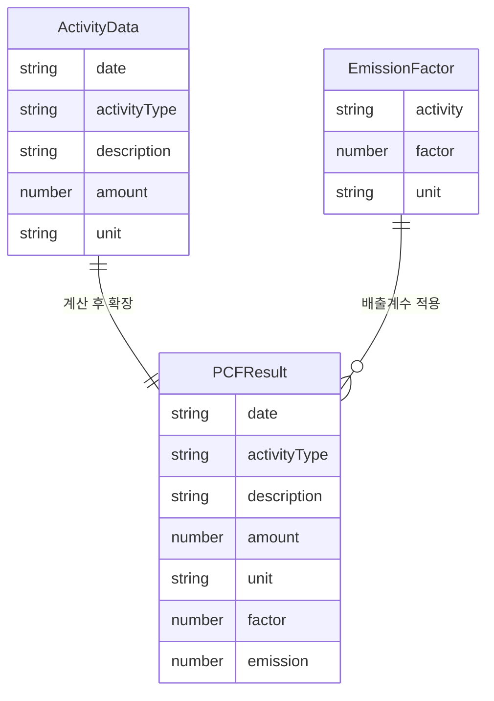
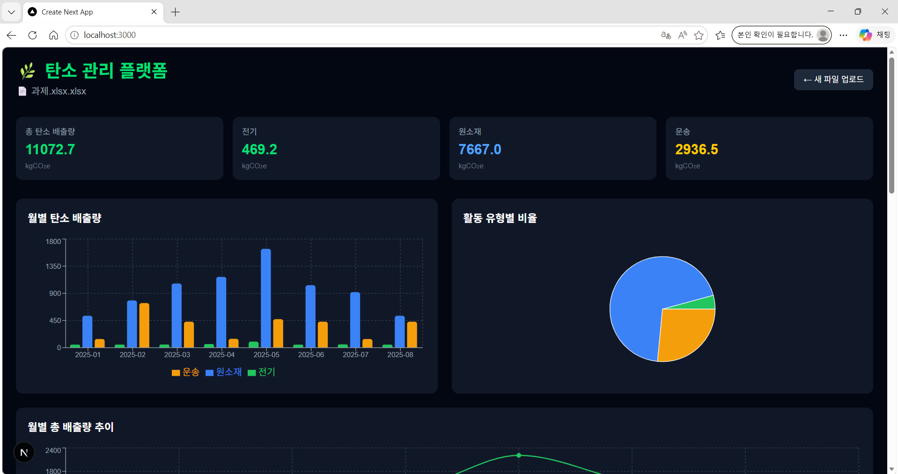
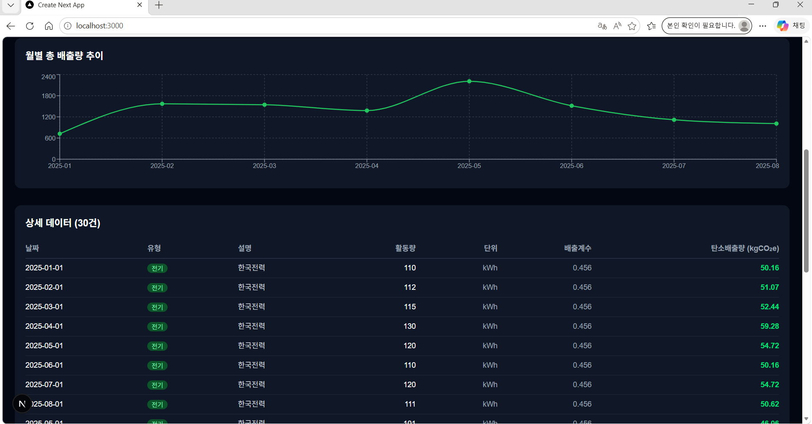
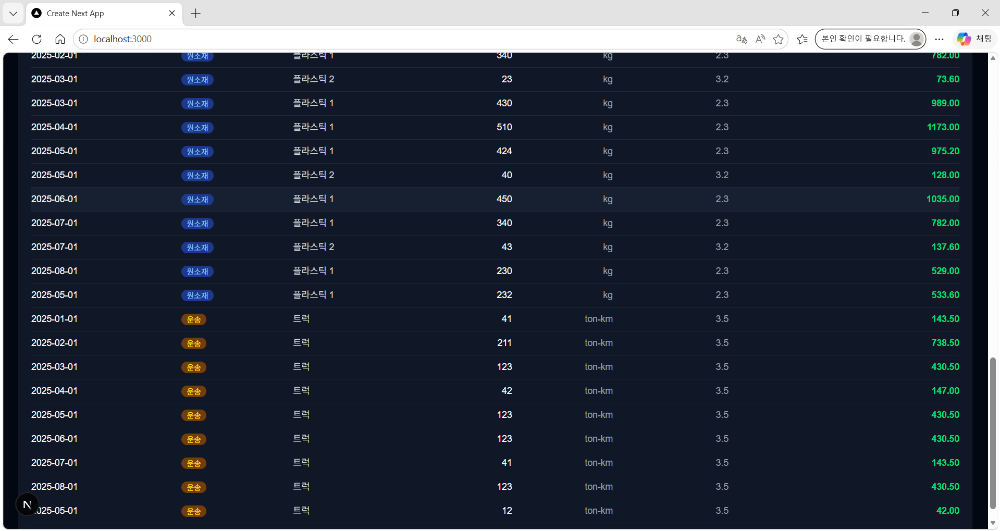

# 탄소 관리 플랫폼(Carbon Management Platform)

> 제조사, 물류사 등 기업 고객이 원소재·전기·운송 데이터를 입력하면 제품별 탄소 발자국(PCF)을 자동 계산하는 SaaS형 대시보드

## Docker로 실행하기

```bash
# 1. 레포포지토리 클론
git clone https://github.com/leehayunddddd/carbon-platform.git

# 2. 폴더 이동
cd carbon-platform

# 3. Docker Compose 실행
docker-compose up
```

> Docker가 설치되어 있으면 위 명령어 하나로 즉시 실행됩니다.

## 로컬 실행 방법

```bash
# 1. 레포지토리 클론
git clone https://github.com/leehayunddddd/carbon-platform.git

# 2. 폴더 이동
cd carbon-platform

# 3. 패키지 설치
yarn install

# 4. 빌드
yarn build

# 5. 실행
yarn start
```

## 기술 스택

프레임워크 : Next.js 14(App Router)
언어 : TypeScript
스타일 : Tailwind CSS
차트 : Recharts
엑셀 파싱 : xlsx

## 시스템 설계

```
src/
├── app/
│   └── page.tsx          # 메인 페이지 (업로드 → 대시보드 전환)
├── components/
│   └── Dashboard.tsx     # 대시보드 UI (차트 + 테이블)
├── lib/
│   ├── excel.ts          # 엑셀 파싱 로직
│   └── pcf.ts            # PCF 계산 로직
└── types/
    └── index.ts          # 타입 정의
```

## 데이터 스키마



### PCF 계산 방식

```

탄소 배출량 = 활동량 x 배출계수

- 전기: 0.456 kgCO₂e / kWh (한국전력 기본값)
- 원소재 플라스틱1: 2.3 kgCO₂e / kg
- 원소재 플라스틱2: 3.2 kgCO₂e / kg
- 운송 트럭: 3.5 kgCO₂e / ton-km

```

## 설계 trade-off

**DB 연동 미포함**
엑셀 임포트만으로 핵심 PCF 계산 기능을 충분히 구현할 수 있어서 초기 복잡도를 줄이는 방향으로 결정했습니다.

**상태 관리: React useState**
앱 규모가 단일 페이지 수준이라 Redux 같은 외부 상태 관리 라이브러리는 오버엔지니어링이라 판단했습니다.

**스타일: Tailwind CSS**
컴포넌트 단위로 빠르게 스타일링할 수 있고, 디자인 일관성을 유지하기 쉬워서 선택했습니다.

**차트: Recharts**
React 기반이라 Next.js와 궁합이 좋고, 커스터마이징이 직관적이어서 선택했습니다.

## AI 사용 내역

본 프로젝트는 Claude를 활용하여 개발했습니다.

프로젝트 구조 설계 단계에서 폴더 구조와 각 파일의 역할을 어떻게 나눌지 AI와 함께 설계했습니다. PCF 계산 로직은 배출계수 기반 계산 함수 구현을 요청했고, 엑셀 파싱은 xlsx 라이브러리를 활용하는 방식으로 구현했습니다. 대시보드 차트와 테이블 컴포넌트도 AI를 통해 초안을 작성한 뒤, 실제 과제 데이터 구조에 맞게 수정했습니다. 디버깅 과정에서는 엑셀 열 인덱스 불일치 문제를 AI와 함께 콘솔 로그를 분석하며 해결했습니다.
AI가 생성한 코드를 그대로 사용하지 않고, 각 로직이 왜 이렇게 동작하는지 직접 이해하고 적용했습니다.

## 주요 기능

- 엑셀 파일 업로드 후 PCF 자동 계산
- 월별 탄소 배출량 바 차트
- 활동 유형별 비율 파이 차트
- 월별 총 배출량 추이 라인 차트
- 상세 데이터 테이블
- 오류 입력 시 에러 메시지 표시

## 화면 미리보기






## 시연 영상

https://youtu.be/9ivhesxSGck

## 타 시스템과의 비교

**기존 엑셀 방식**
담당자가 직접 수식을 관리해야 해서 오류가 생기기 쉽고, 데이이터가 많아 질수록 관리가 어렵습니다. 또한 시각화도 별도로 작업해야 해서 실시간 현황 파악이 어렵습니다.

**대형 탄소회계 솔루션**
기능은 풍부하지만 도입 비용이 높고 커스터마이징이 어려워 중소 제조사·물류사가 사용하기에는 과도한 스펙입니다.

**본 시스템**
기업이 이미 관리하고 있는 엑셀 데이터 그대로 업로드하면 PCF를 자동으로 계산하고 실시간으로 시각화합니다. 별도의 데이터 전환 없이 바로 도입할 수 있고, 필요에 따라 기능을 확장하기 쉬운 구조입니다.

## 작업 소요 시간

총 소요 시간: 약 10시간

| 작업                       | 소요 시간 |
| -------------------------- | --------- |
| 프로젝트 설계 및 환경 설정 | 1시간     |
| PCF 계산 로직 구현         | 1.5시간   |
| 엑셀 파싱 구현 및 디버깅   | 2시간     |
| 대시보드 UI 구현           | 3시간     |
| Docker 설정                | 2시간     |
| README 작성                | 1시간     |

**시간이 많이 소요된 부분**
엑셀 열 인덱스 불일치 문제 디버깅에 시간이 걸렸습니다. 과제 데이터의 컬럼 구조를 파악하고 콘솔 로그로 직접 확인하며 해결했습니다.

## AI 활용내역

### 1.설계

- 사용 목적
  Next.js + TypeScript 기반의 PCF(Product Carbon Footprint) 계산 대시보드 구조를 설계하기 위해 AI를 활용했습니다.

- 사용 Prompt
  `Next.js + TypeScript 기반 PCF 계산 대시보드 폴더 구조 설계`

- 활용 방식 및 판단  
  AI가 제안한 구조를 참고하여 계산 로직과 UI를 분리하는 방향으로 설계했습니다.  
  특히 배출계수 변경 시 수정 범위를 최소화하기 위해 `lib/pcf.ts`에서 계산 로직을 관리하도록 구성했습니다.

  ### 2. 구현

- 사용 목적  
  배출량 계산 로직 구현 과정에서 계산식 검증과 TypeScript 타입 구조 작성을 위해 AI를 활용했습니다.

- 사용 Prompt  
  `배출계수 기반 탄소 배출량 계산 함수 구현`

- 활용 방식 및 판단  
  PCF 계산 공식인 `활동량 × 배출계수` 구조를 기반으로 구현하였으며,  
  AI가 제안한 예시 코드를 그대로 사용하기보다 현재 프로젝트 데이터 구조에 맞게 수정하여 적용했습니다.  
  또한 타입 안정성을 위해 TypeScript 타입 정의를 추가했습니다.

  ### 3. 디버깅

- 사용 목적  
  엑셀 업로드 후 데이터가 정상적으로 파싱되지 않는 문제를 해결하기 위해 AI를 활용했습니다.

- 사용 Prompt  
  `엑셀 업로드 후 데이터가 파싱되지 않는 문제 해결`

- 활용 방식 및 판단  
  AI가 제안한 디버깅 방법을 참고하여 콘솔 로그로 실제 데이터 구조를 직접 확인했습니다.  
  이후 열 인덱스와 데이터 매핑 구조를 비교하면서 원인이 컬럼 불일치 문제임을 확인하고 수정했습니다.

> AI는 구현 방향과 문제 해결 아이디어를 참고하는 용도로 활용했으며,  
> 실제 프로젝트 구조와 요구사항에 맞게 수정·검증 후 적용했습니다.

### 4. UI 디자인

- 사용 목적  
  대시보드 UI 구조와 사용자 흐름을 빠르게 탐색하기 위해 AI를 활용했습니다.

- 사용 Prompt  
  `탄소 배출량 대시보드 UI 레이아웃 추천`

- 활용 방식 및 판단  
  AI가 제안한 UI 레이아웃을 참고하여 Figma에서 초기 화면 구조를 설계했습니다.  
  이후 데이터 가독성과 사용자 흐름을 고려하여 카드 구성과 섹션 배치를 수정한 뒤 실제 UI로 구현했습니다.
